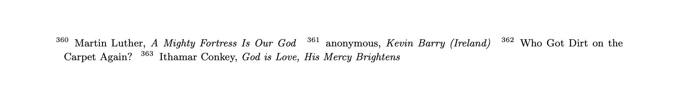

# Eyes and Ears Alt

Alternative versions of Ben Crowell's [*Eyes and Ears: An Anthology of Melodies for Sight-Singing*](http://www.lightandmatter.com/sight/sight.html).

Features:

- Title and composer above each piece
- Built-in PDF outline for easy navigation
- Bass clef version also available

## Download

- [Treble clef version](https://github.com/pnlng/eyes-and-ears-alt/releases/download/v0.0.1/eyes-and-ears-treble.pdf)
- [Bass clef version](https://github.com/pnlng/eyes-and-ears-alt/releases/latest/download/eyes-and-ears-bass.pdf)


## Features

#### Title and composer above each piece


Instead of being in the footnotes, as in the original version,



...or only available in the table of contents and index, as in the Clairnote version. 

#### Built-in PDF outline/bookmarks for easy navigation


#### Bass clef version of the book also available

For those who would like more practice in reading the bass clef.


  

## Other versions

This alternative version is built on

- The Clairnote version by Paul Morris
  - [pdf (letter size)](https://clairnote.org/more-sheet-music-files/eyes-and-ears-clairnote-sn-let.pdf)
  - [source](https://github.com/PaulMorris/eyes-and-ears-clairnote)

which in turn is a modification of

- The original version by Ben Crowell 
  - [site](http://www.lightandmatter.com/sight/sight.html)
  - [source](https://github.com/bcrowell/eyes_and_ears)

## Known Issues

- The book occasionally makes clef-specific references that may not make sense. No editing attempts have been made. 
- The index and thematic index in the original and Clairnote versions are absent in this version. 
  - It would take quite a bit of effort to tidy up the index, in particular, and I would rather just leave it out. 
- PDF outlines are created semi-manually using the [pdfoutliner](https://github.com/GHPen/pdfoutliner) tool. 
  - Lilypond doesn't support PDF outlines natively, AFAIK. 
  - One might be able to create a LaTeX version using `lilypond-book` and use the `hyperref` or `navigator` package. 

## Build

With [pdfoutliner](https://github.com/GHPen/pdfoutliner) installed: 

```
# bass clef
make pdf
# treble clef
make pdf CLEF=treble
```

No PDF outlines:

```
# bass clef
make book
# treble clef
make book CLEF=treble
```
